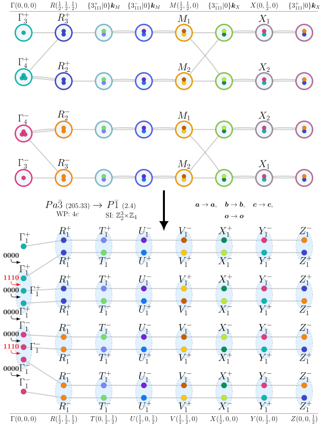

## Automated Discovery of Topological Magnon Materials
### How to use the tools to diagnose a material
For a given material, the magnetic space group and the Wyckoff position of the magnetic atoms need to be known. Given this data, we proceed in two steps:
1. Prefetch and preprocess data for the search by running
```
bazel run //diagnose/preprocess:perturb_relevant -- <MSG-NUMBER> <WP-LABEL>
```
2.  Run the search algorithm with
```
bazel run //diagnose:diagnose -- <MSG-NUMBER> <WP-LABEL> <SUBGROUP-INDEX>
```
### Example using MSG `Pa-3` and WP `4c`
The MSG number of `Pa-3` is 205.33. For any magnetic material with this MSG & WP, we execute the following two commands:
```
bazel run //diagnose/preprocess:perturb_relevant  -- 205.33 4c
bazel run //diagnose:diagnose -- 205.33 4c 4
```

This results in a positive results. As a result, three LaTeX files will be created automatically: 2 figures and 1 document that includes summary text, tables and figures. In the example above, the three files will be created at the following location
```
/tmp/205.33-4c-4-2.4-figure-high.tex
/tmp/205.33-4c-4-2.4-figure-low.tex
/tmp/205.33-4c-4-2.4-doc.tex
```
As a demonstration, compiling the first file with `pdflatex`,
```
pdflatex /tmp/205.33-4c-4-2.4-figure-high.tex
```
results in the following figure:




# References
TBD
