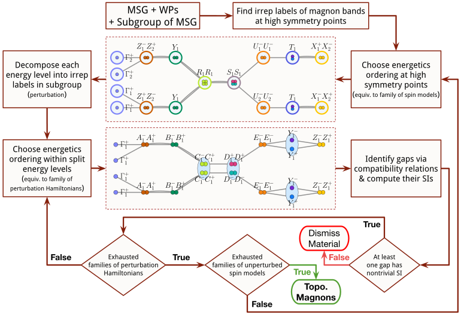

## Automated Discovery of Topological Magnon Materials
### Summary of the algorithm


### How to execute the algorithm to diagnose a specific material
For a given material, the magnetic space group and the Wyckoff position of the magnetic atoms need to be known. Given this data, we proceed in two steps:
1. Prefetch and preprocess data for the search by running
```
bazel run //preprocess:analyze_relevant_subgroups -- --msg_number <MSG-NUMBER> --wp <WP-LABEL>

```
2.  Run the search algorithm with
```
bazel run //diagnose:diagnose -- --msg_number <MSG_NUMBER> --wp <WP> --subgroup_index <SUBGROUP_INDEX>
```
### Example using MSG `Pa-3` and WP `4c`
The MSG number of `Pa-3` is 205.33. For any magnetic material with this MSG & WP, we execute the following two commands:
```
bazel run //preprocess:analyze_relevant_subgroups -- --msg_number 205.33 --wp 4c
bazel run //diagnose:diagnose -- --msg_number 205.33 --wp 4c --subgroup_index 4
```

This leads to a positive result. Subsequently, three LaTeX files will be created automatically at the following location
```
/tmp/205.33-4c-4-2.4-figure-high.tex
/tmp/205.33-4c-4-2.4-figure-low.tex
/tmp/205.33-4c-4-2.4-doc.tex
```
As a demonstration, compiling the first file with `pdflatex`,
```
pdflatex /tmp/205.33-4c-4-2.4-figure-high.tex
```
results in the following figure:


# References
TBD
